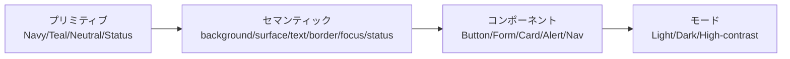

# CareTeal（パレットD）実装デザイン指示書

## エグゼクティブサマリー

本指示書は、**CareTeal（濃紺×白＋深いティール）**を前提に、デザイナー・フロントエンド・QAが同じ基準で実装/検証できるように、**トークン設計、WCAGコントラスト（AA/AAA）、コンポーネント状態、ダークモード再割当、色覚多様性対応、実装落とし穴、運用/QA手順**を具体化したものです。  
コントラスト指標は、WCAG 2.2の定義（相対輝度・コントラスト比）に基づき算出し、**判定は“丸めず”閾値比較**、表示は可読性のため小数点2桁に整形しています。citeturn5search1turn5search3turn5search2  
設計の最重要ポイントは次の3つです。

- **重要テキストはAA（4.5:1）最低ライン、主要導線はAAA（7:1）を実務目標**に置く（特に本文・主要ボタン・リンク）。citeturn0search0turn5search4  
- **重要な非テキスト（ボーダー、フォーカスリング、チェック状態など）は3:1以上**を必須（SC 1.4.11相当）。citeturn0search1turn8view0  
- 色だけに意味を閉じない（SC 1.4.1）。加えて、OSの「コントラスト増加」「透明度低減」等の設定で崩れないことを実機で確認する。citeturn1search2turn8view0turn10view0  

## トークン設計とカラースウォッチ

### 前提として置く仮定

未指定事項は以下を仮定します（プロジェクト事情で異なる場合は、**この仮定を差し替えた上で再計算**してください）。

- “通常テキスト”扱いの箇所が多い（本文・リスト・フォームラベル等）。よって、通常テキスト基準（AA 4.5:1、AAA 7:1）を主に満たす設計とする。citeturn0search0turn5search4  
- 非テキストの境界（入力枠、チェックボックス、選択状態の可視差分など）は 3:1 を必須とする。citeturn0search1turn8view0  
- 色の意味伝達（成功/失敗、選択状態など）は、**アイコン・文言・形状・配置**で冗長化し、色覚差やグレースケールでも成立させる。citeturn1search2turn10view0  

### トークン階層

「**プリミティブ（色そのもの）**」と「**セマンティック（用途）**」を分離します。UI実装は“セマンティックのみ参照”を原則にすると、ダークモードや将来のブランド調整が破綻しにくくなります（Material 3でも、色の“役割”を正しく組み合わせることが強調されます）。citeturn6view3  



image_group{"layout":"carousel","aspect_ratio":"16:9","query":["navy teal color palette swatch","teal navy mobile app UI design","dark mode teal accent navy UI"],"num_per_query":1}

### カラートークン一覧（Light）

表は「セマンティックトークン」中心です（実装で直接参照する想定）。HEXとRGBは固定値、用途ラベルは primary/secondary/surface/background/text/border/focus/status などに揃えます。

| トークン | 用途ラベル | HEX | RGB | 指示（実装用途） |
|---|---|---|---|---|
| `bg` | background | `#FFFFFF` | 255,255,255 | アプリ全体の基底背景 |
| `surface` | surface | `#ECFDF5` | 236,253,245 | カード面・フォーム面・セクション背景（白の眩しさ軽減） |
| `primary` | primary | `#0B1F3B` | 11,31,59 | 濃紺：ナビ/ヘッダー/主要ボタン背景 |
| `secondary` | secondary | `#115E59` | 17,94,89 | 深いティール：リンク/サブCTA/選択強調 |
| `text` | text | `#0B1F3B` | 11,31,59 | 本文・見出し・主要ラベル |
| `text/muted` | text | `#334155` | 51,65,85 | 補助文・注釈・メタ情報 |
| `text/inverse` | text | `#FFFFFF` | 255,255,255 | 濃色塗り上（primary/secondary/status）の文字 |
| `text/placeholder` | text | `#64748B` | 100,116,139 | プレースホルダ（AA確保、ただし強すぎ注意） |
| `border/strong` | border | `#64748B` | 100,116,139 | 入力枠・インタラクティブ境界（3:1必須領域） |
| `border/subtle` | border | `#CBD5E1` | 203,213,225 | 罫線/区切り（装飾用、境界の唯一手段にしない） |
| `focus` | focus | `#1E40AF` | 30,64,175 | フォーカスリング/キーボードフォーカス |
| `surface/disabled` | surface | `#E2E8F0` | 226,232,240 | disabled面（ボタン/入力の無効背景） |
| `text/disabled` | text | `#475569` | 71,85,105 | disabled文字（AA確保しつつ“無効感”） |
| `status/success` | status | `#166534` | 22,101,52 | 成功（本文テキスト・バッジ背景・アイコン） |
| `status/warning` | status | `#92400E` | 146,64,14 | 警告 |
| `status/danger` | status | `#991B1B` | 153,27,27 | エラー/危険 |
| `status/info` | status | `#1E40AF` | 30,64,175 | 情報（focusと同系統、用途で使い分け） |
| `status/success-surface` | status | `#F0FDF4` | 240,253,244 | 成功アラート面 |
| `status/warning-surface` | status | `#FFFBEB` | 255,251,235 | 警告アラート面 |
| `status/danger-surface` | status | `#FEF2F2` | 254,242,242 | エラーアラート面 |
| `status/info-surface` | status | `#EFF6FF` | 239,246,255 | 情報アラート面 |

### カラートークン一覧（Dark override）

ダークモードは「白を反転しただけ」にしないこと。特に、暗背景上の**低コントラスト灰（gray-on-black）**は可読性事故が起きやすいので、本文・主要導線は高めを維持します。citeturn8view0  

| トークン | 用途ラベル | HEX | RGB | 指示（再割当の意図） |
|---|---|---|---|---|
| `bg` | background | `#071A2E` | 7,26,46 | 画面基底を濃紺寄りに固定（真っ黒回避） |
| `surface` | surface | `#0B1F3B` | 11,31,59 | カード/入力面（bgとの差は“境界線＋影”で担保） |
| `primary` | primary | `#0B1F3B` | 11,31,59 | ナビ領域の塗り（lightとブランド整合） |
| `secondary` | secondary | `#2DD4BF` | 45,212,191 | アクション/リンクを明度で際立たせる |
| `text` | text | `#F8FAFC` | 248,250,252 | 本文 |
| `text/muted` | text | `#CBD5E1` | 203,213,225 | 補助文 |
| `text/inverse` | text | `#071A2E` | 7,26,46 | 明るいsecondary上の文字 |
| `border/strong` | border | `#64748B` | 100,116,139 | 非テキスト境界3:1を満たす“必須境界” |
| `border/subtle` | border | `#334155` | 51,65,85 | 区切り（装飾） |
| `focus` | focus | `#A5B4FC` | 165,180,252 | 暗背景でも見失いにくいフォーカス |
| `surface/disabled` | surface | `#0A1D36` | 10,29,54 | disabled面 |
| `text/disabled` | text | `#94A3B8` | 148,163,184 | disabled/placeholder（AA確保しつつ抑制） |
| `status/success` | status | `#22C55E` | 34,197,94 | 暗背景用に明度上げ（可読性優先） |
| `status/warning` | status | `#F59E0B` | 245,158,11 | 同上 |
| `status/danger` | status | `#FDA4AF` | 253,164,175 | 同上（AAA確保） |
| `status/info` | status | `#38BDF8` | 56,189,248 | 情報（focusと色相をずらす） |
| `status/success-surface` | status | `#062612` | 6,38,18 | 成功アラート面 |
| `status/warning-surface` | status | `#2A1B00` | 42,27,0 | 警告アラート面 |
| `status/danger-surface` | status | `#2B0A0A` | 43,10,10 | エラーアラート面 |
| `status/info-surface` | status | `#001A33` | 0,26,51 | 情報アラート面 |

## コントラスト評価

### 評価基準と計算方法

- コントラスト比はWCAG 2.2の定義（(L1+0.05)/(L2+0.05)）を使用。citeturn5search1  
- 相対輝度（sRGBの線形化・係数 0.2126/0.7152/0.0722）はWCAGの定義に従う。citeturn5search3  
- 閾値比較時は**丸めない**（4.499は4.5未満として不合格）。本書は表示のみ小数点2桁。citeturn5search2turn5search5  
- AA/AAA判定は、通常テキストAA=4.5:1、AAA=7:1。citeturn0search0turn5search4  
- 非テキスト境界（入力枠・チェック等）は3:1以上を“AA相当（必須）”として扱う。citeturn0search1turn8view0  

### コントラスト結果（Light）

| 用途/要素 | 前景トークン | 背景トークン | コントラスト比 | AA | AAA | 分類 |
|---|---|---:|---:|:--:|:--:|---|
| 本文テキスト | `text` | `bg` | 16.49 | 可 | 可 | テキスト |
| 補助テキスト | `text/muted` | `bg` | 10.35 | 可 | 可 | テキスト |
| カード/面上テキスト | `text` | `surface` | 15.66 | 可 | 可 | テキスト |
| リンク | `secondary` | `bg` | 7.58 | 可 | 可 | テキスト |
| 主要ボタン（塗り） | `text/inverse` | `primary` | 16.49 | 可 | 可 | テキスト |
| 副ボタン（塗り） | `text/inverse` | `secondary` | 7.58 | 可 | 可 | テキスト |
| フォーム境界（必須） | `border/strong` | `bg` | 4.76 | 可 | — | 非テキスト(境界/アイコン) |
| フォーム境界（面上） | `border/strong` | `surface` | 4.52 | 可 | — | 非テキスト(境界/アイコン) |
| 区切り線（装飾） | `border/subtle` | `bg` | 1.48 | 対象外 | 対象外 | 装飾(基準外) |
| フォーカスリング | `focus` | `bg` | 8.72 | 可 | — | 非テキスト(境界/アイコン) |
| プレースホルダ | `text/placeholder` | `bg` | 4.76 | 可 | 不可 | テキスト |
| 無効テキスト | `text/disabled` | `surface/disabled` | 6.15 | 可 | 不可 | テキスト |
| 成功ラベル（テキスト/アイコン） | `status/success` | `bg` | 7.13 | 可 | 可 | テキスト |
| 警告ラベル（テキスト/アイコン） | `status/warning` | `bg` | 7.09 | 可 | 可 | テキスト |
| エラーラベル（テキスト/アイコン） | `status/danger` | `bg` | 8.31 | 可 | 可 | テキスト |
| 情報ラベル（テキスト/アイコン） | `status/info` | `bg` | 8.72 | 可 | 可 | テキスト |
| 成功バッジ（白文字/成功背景） | `text/inverse` | `status/success` | 7.13 | 可 | 可 | テキスト |
| 警告バッジ（白文字/警告背景） | `text/inverse` | `status/warning` | 7.09 | 可 | 可 | テキスト |
| エラーバッジ（白文字/エラー背景） | `text/inverse` | `status/danger` | 8.31 | 可 | 可 | テキスト |

### コントラスト結果（Dark）

| 用途/要素 | 前景トークン | 背景トークン | コントラスト比 | AA | AAA | 分類 |
|---|---|---:|---:|:--:|:--:|---|
| 本文テキスト | `text` | `bg` | 16.78 | 可 | 可 | テキスト |
| 補助テキスト | `text/muted` | `bg` | 11.82 | 可 | 可 | テキスト |
| カード/面上テキスト | `text` | `surface` | 15.76 | 可 | 可 | テキスト |
| リンク | `secondary` | `bg` | 9.43 | 可 | 可 | テキスト |
| 主要ボタン（塗り） | `text/inverse` | `secondary` | 9.43 | 可 | 可 | テキスト |
| ナビ/ヘッダー内テキスト | `text` | `primary` | 15.76 | 可 | 可 | テキスト |
| フォーム境界（必須） | `border/strong` | `bg` | 3.69 | 可 | — | 非テキスト(境界/アイコン) |
| フォーム境界（面上） | `border/strong` | `surface` | 3.47 | 可 | — | 非テキスト(境界/アイコン) |
| 区切り線（装飾） | `border/subtle` | `bg` | 1.70 | 対象外 | 対象外 | 装飾(基準外) |
| フォーカスリング | `focus` | `bg` | 8.81 | 可 | — | 非テキスト(境界/アイコン) |
| プレースホルダ/無効テキスト | `text/disabled` | `surface` | 6.43 | 可 | 不可 | テキスト |
| 成功ラベル（テキスト/アイコン） | `status/success` | `bg` | 7.70 | 可 | 可 | テキスト |
| 警告ラベル（テキスト/アイコン） | `status/warning` | `bg` | 8.17 | 可 | 可 | テキスト |
| エラーラベル（テキスト/アイコン） | `status/danger` | `bg` | 9.28 | 可 | 可 | テキスト |
| 情報ラベル（テキスト/アイコン） | `status/info` | `bg` | 8.19 | 可 | 可 | テキスト |

**設計判断（重要）**  
- `border/subtle` は、Light/Darkともに 3:1 を満たしません。よって、**入力枠・選択状態・重要な境界の唯一の手段に利用禁止**（装飾・罫線に限定）。citeturn0search1turn8view0  

## コンポーネント別配色・状態仕様

### ボタン

#### ボタンの種類

- **Primary（主要CTA）**：Lightは `primary` 塗り＋白文字。Darkは **`secondary` 塗り＋濃紺文字**（暗背景での視認性と“押せる感”を確保）。Darkで `primary` 塗りにすると背景と同化しやすいため、役割を“セマンティック”で切り替える。citeturn6view3  
- **Secondary（副CTA）**：Lightは `secondary` 塗り＋白文字、Darkは **アウトライン**を推奨（主要導線の競合を避ける）。  
- **Destructive（危険操作）**：`status/danger` を使用。  
- **Tertiary/Text（低優先アクション）**：塗りなし、下線/アイコンで可押性を補助（色だけに依存しない）。citeturn1search2turn10view0  

#### Primaryボタン状態（Light：濃紺塗り）

| 状態 | 背景 | 文字 | ボーダー | 影 | 透明度/オーバーレイ | 指示（実装注意） |
|---|---|---|---|---|---|---|
| default | `#0B1F3B` (`primary`) | `#FFFFFF` | なし | elevation 2相当 | なし | 主要導線。文字は必ず `text/inverse` |
| hover | `#0A1D36` | `#FFFFFF` | なし | elevation 3相当 | なし | ポインタ環境のみ（iPadOS/Web想定） |
| active | `#091A32` | `#FFFFFF` | なし | elevation 1相当 | なし | 押下で“沈む”表現（影を弱く） |
| disabled | `#E2E8F0` (`surface/disabled`) | `#475569` (`text/disabled`) | なし | なし | opacityは禁止 | **disabledは“薄い白文字”にしない**（可読性が落ちるため） |

#### Secondaryボタン状態（Light：ティール塗り）

| 状態 | 背景 | 文字 | ボーダー | 指示 |
|---|---|---|---|---|
| default | `#115E59` (`secondary`) | `#FFFFFF` | なし | “次の一手”に限定 |
| hover | `#105652` | `#FFFFFF` | なし | 主要CTAと識別できる範囲で暗く |
| active | `#0E4F4B` | `#FFFFFF` | なし | 押下はさらに暗く |
| disabled | `#E2E8F0` | `#475569` | なし | disabledは共通設計（塗り色は使わない） |

#### DarkモードのPrimaryボタン（ティール塗り＋濃紺文字）

Darkでは “押せる面” を背景から分離することが主目的です。Appleの評価基準でも、ダークモード時のコントラスト不足（gray-on-black等）や、透明度/ぼかし素材の影響が落とし穴として明示されています。citeturn8view0  

| 状態 | 背景 | 文字 | 指示（コントラスト確保） |
|---|---|---|---|
| default | `#2DD4BF` (`secondary`) | `#071A2E` (`text/inverse`) | AA/AAAともに可（9.43） |
| hover | `#3AD7C3`（secondaryを約6%白寄せ） | `#071A2E` | hoverは“明るく”して可視性を上げる |
| active | `#29C3B0`（secondaryを約8%黒寄せ） | `#071A2E` | activeは“沈む”として少し暗く |
| disabled | `#0A1D36` (`surface/disabled`) | `#94A3B8` (`text/disabled`) | 透明度で薄くするより、トークンで制御 |

### カード

- 背景：Lightは `bg`、情報密度を上げる領域は `surface` を許可。Darkは `surface`。  
- ボーダー：カードの枠は原則 **`border/subtle`（装飾）**か影で表現し、フォーム境界の `border/strong` と混同させない。  
- 影：Lightは elevation 1〜2相当、Darkは影が見えにくいので「影＋subtleボーダー」を併用して面を分離。

### ヘッダー/フッター（ナビゲーション領域）

- Light：背景 `primary`、文字 `text/inverse`、アイコン `text/inverse`。  
- Dark：背景 `primary`（= `surface`）、文字 `text`。  
- 区切り：下線は **Light：`border/subtle`、Dark：`border/subtle`**（装飾）。ただし境界線だけで階層を伝えない。

### リンク

- 既定色：Light `secondary`、Dark `secondary`。  
- 本文中リンクは必ず **下線**（または外部リンクアイコン等）を併用し、色だけでリンクと分かる設計を避ける（SC 1.4.1意図）。citeturn1search2  
- タップ領域：下線はタップ領域を狭めるため、タップ対象がテキストの場合も行間/余白を確保（色の話から逸れるため値は未指定）。

### フォーム要素（入力/フォーカス/エラー/プレースホルダ）

Appleの評価基準は、**透明度・ぼかし・背景素材**が可読性を落とし得る点を明示し、さらに非テキスト目標（3:1）を推奨しています。citeturn8view0  
よってフォームは「透明/半透明」をデフォルト禁止とし、どうしても使う場合は背景別に再評価します。

**入力（TextField）仕様（Light）**

| 状態 | 背景 | 文字 | プレースホルダ | 境界 | フォーカス/リング | エラー表示（冗長化） |
|---|---|---|---|---|---|---|
| default | `bg` | `text` | `text/placeholder` | `border/strong` 1px | なし | なし |
| focus | `bg` | `text` | 同上 | `focus` 2px | `focus` のリング（外側2px、α0.24まで） | なし |
| error | `bg` | `text` | 同上 | `status/danger` 2px | リングは危険色（外側2px、α0.20まで） | **アイコン＋文言**（色のみ禁止）citeturn10view0turn1search2 |
| disabled | `surface/disabled` | `text/disabled` | `text/disabled` | `border/subtle` 1px | なし | なし |

**入力（Dark）**
- 背景：`surface`、文字：`text`  
- 境界：default `border/strong` 1px（**3:1を満たす**）  
- focus：`focus` 2px + 外側リング（α0.28まで）  
- placeholder：`text/disabled`（AA確保）

### バッジ/タグ

- Filled（推奨）：背景＝`secondary` or `status/*`、文字＝`text/inverse`（Light）/ `text/inverse`（Darkは `#071A2E`）  
- Outline：背景透明、ボーダー＝`border/strong`、文字＝`text`（ただし重要度が低いタグに限定）

### 通知/アラート（バナー/インライン/トースト）

**原則**：状態を色だけで伝えない（タイトル文言・アイコン・形状を併用）。これはWCAGの意図にも、Appleの「Differentiate Without Color Alone」評価基準にも一致します。citeturn1search2turn10view0  

**インラインアラート（画面内）**
- Light：背景＝`status/*-surface`、左ボーダー＝`status/*` 4px、アイコン＝`status/*`、本文文字＝`text`、補助文字＝`text/muted`  
- Dark：背景＝`status/*-surface`（dark側）、左ボーダー＝`status/*`、本文文字＝`text`  
- 閉じるボタン：アイコン `text/muted`、hover/activeは小さい背景tint（ただし透明度は面の上でのみ）

**トースト（短時間表示）**
- Light：背景＝`primary`、文字＝`text/inverse`、アイコン＝`text/inverse`  
- Dark：背景＝`surface`、ボーダー＝`border/strong`（1px）、文字＝`text`

## ダークモード設計指示

### 再割当の基本方針

- 背景を暗くしても、**本文・主要導線のコントラストを落とさない**。Appleの「Sufficient Contrast」評価でも、ライトはOKでもダークで不足する事故が典型とされています。citeturn8view0  
- Material系の設計でも、色の“役割”を正しく組み合わせ（例：primaryとonPrimaryのように）、ミスマッチを避けることが示されます。citeturn6view3  

### 明度/彩度調整ルール（実装ルール）

- Light→Darkで**同じHEXを反転しない**。  
- Darkでは、アクセント（secondary）を**明るく**して“押せる要素”を担わせる。  
- 境界（border/strong）は、Darkでも **3:1以上**を必須（下表の結果で 3.47〜3.69 を確保）。

### 非テキストコントラストの数値目標

- 入力枠・チェック・トグル・選択状態の境界：**3.00以上（必須）**citeturn0search1turn8view0  
- フォーカスリング：**3.00以上（必須）**（本設計は8.81）  
- 装飾区切り（情報階層に必須でない）：1.50以上を推奨（ただし基準対象外）。必要なら `border/strong` へ昇格。

### OS設定を踏まえた検証指示（ダークモード）

entity["company","Apple","consumer electronics firm"] の評価基準は、**Bold Text / Increase Contrast / Reduce Transparency をONにしてテスト**することを推奨し、さらに「ダークモード×コントラスト増加」の組み合わせテストも推奨しています。citeturn8view0  
よってQAは「通常設定」だけで合格にしないでください（詳細は後述チェックリスト）。

## 色覚多様性対応

### 守るべきルール（具体）

- 状態（成功/警告/エラー/選択）を、**色だけで区別しない**。  
  - 必須：アイコン（✓/!/×）、タイトル文言（例：「エラー」）、形状（角丸バッジ/枠の太さ）、位置（左ボーダー）で冗長化。citeturn1search2turn10view0  
- グラフ/チャート（もし存在する場合）：系列の順番を凡例と一致させる、ラベル直書き、ハッチング等を併用（Apple基準でも推奨）。citeturn10view0  

### シミュレーションとテスト手順

- デザイン段階（Figma）：Color Contrast Checkerで、前景/背景HEXを入れてAA/AAA判定し、色覚シミュレーション（Protanopia/Deuteranopia等）で破綻を確認する。citeturn2view2  
- デザインシステム段階（Stark）：コントラストが落ちた場合は、StarkのColor SuggestionsでAA/AAAを満たす代替色提案を使い、**親コンポーネントで直す**（インスタンス修正の拡散を防ぐ）。citeturn2view3  
- 実機段階：  
  - iOS：グレースケール等のフィルタで「色に依存してないか」を炙り出す（Appleの評価基準で推奨）。citeturn10view0  
  - Android：Accessibility Scannerで「テキスト/画像コントラスト」指摘を確認。ただし自動チェックは万能ではなく、手動検証も必須。citeturn7view2turn6view6  
  - 読み上げ/探索（必要な画面のみ）：AndroidはTalkBack等で要素理解を確認（色の問題が“状態把握”の問題に波及していないか見る）。citeturn6view6  

## 実装・運用・QAチェックリスト

### 実装上の注意点と落とし穴（重要）

- **透明度（alpha）を文字色に使わない**：背景が変わるとコントラストが不定になり、AA割れしやすい。  
- 半透明素材（ぼかし、ガラス、scrim）上のテキストは危険：Appleも、透過/ぼかしの影響を評価対象に含めるべきと述べています。citeturn8view0  
- 背景画像上のテキスト：必ず不透明に近い面（カード/ラベル）か、十分なscrimを敷いて“最悪ケース背景”で再計算。FigmaやStarkのようなツールで前景/背景をサンプルし、数値で確認。citeturn2view2turn2view3  
- 動的コンテンツ（UGC、広告、外部埋め込み）：背景が予測不能。Appleの基準でも、第三者コンテンツの扱いを別途考慮する必要性に触れています。citeturn8view0  
- ダークモードの“灰文字”化：ライトでOKでもダークで不足する典型。Appleが明確に注意喚起。citeturn8view0  
- OS高コントラスト設定（Web/ハイブリッドの場合）：`prefers-contrast` や `forced-colors` に追従し、最悪ケースでボーダー/リンクが消えないことを確認。citeturn3search2turn3search1turn3search16  

### Figma/Sketch運用ルールとチェックリスト

**命名規則（推奨）**
- セマンティック：`Color/{Role}/{State}`（例：`Color/Text/Default`）  
- プリミティブ：`Primitive/Navy/900` のように色相＋階調  
- 目的：`/` 区切りでグルーピングできる仕組みを活用し、検索性を担保（Sketchでも `/` で自動グループ化可能）。citeturn6view4  

**ライブラリ運用**
- Sketch：Color Variablesはドキュメント内同期とライブラリ共有が可能。変更が使われているレイヤーに反映される。citeturn6view4  
- Sketch：Color Variablesはトークンとして書き出し（CSS/JSON等）可能で、ハンドオフに使える。citeturn6view4  

**レビュー（最低限チェック）**
- 重要画面（オンボーディング、ログイン、購入/決済、フォーム送信、エラー表示）を対象に、Figmaのコントラスト検証を実施。citeturn2view2  
- Starkで主要コンポーネント（Button/TextField/Alert）をチェックし、必要なら提案色で修正。citeturn2view3  
- “色だけで伝えている箇所”をレビュー項目として明文化（SC 1.4.1の意図）。citeturn1search2  

### CSS変数例（CareTealベース）

```css
:root {
  /* Core */
  --bg: #FFFFFF;
  --surface: #ECFDF5;

  --primary: #0B1F3B;
  --secondary: #115E59;

  --text: #0B1F3B;
  --text-muted: #334155;
  --text-inverse: #FFFFFF;
  --text-placeholder: #64748B;

  --border-strong: #64748B; /* interactive boundary */
  --border-subtle: #CBD5E1; /* decorative only */
  --focus: #1E40AF;

  --surface-disabled: #E2E8F0;
  --text-disabled: #475569;

  /* Status */
  --status-success: #166534;
  --status-warning: #92400E;
  --status-danger:  #991B1B;
  --status-info:    #1E40AF;

  --status-success-surface: #F0FDF4;
  --status-warning-surface: #FFFBEB;
  --status-danger-surface:  #FEF2F2;
  --status-info-surface:    #EFF6FF;
}

[data-theme="dark"] {
  --bg: #071A2E;
  --surface: #0B1F3B;

  --primary: #0B1F3B;
  --secondary: #2DD4BF;

  --text: #F8FAFC;
  --text-muted: #CBD5E1;
  --text-inverse: #071A2E; /* on bright secondary */
  --text-placeholder: #94A3B8;

  --border-strong: #64748B; /* >= 3:1 on bg/surface */
  --border-subtle: #334155; /* decorative */
  --focus: #A5B4FC;

  --surface-disabled: #0A1D36;
  --text-disabled: #94A3B8;

  --status-success: #22C55E;
  --status-warning: #F59E0B;
  --status-danger:  #FDA4AF;
  --status-info:    #38BDF8;

  --status-success-surface: #062612;
  --status-warning-surface: #2A1B00;
  --status-danger-surface:  #2B0A0A;
  --status-info-surface:    #001A33;
}
```

### コンポーネント用SCSS例（ボタン/カード/フォーム）

```scss
.Button {
  display: inline-flex;
  align-items: center;
  justify-content: center;
  gap: 8px;
  border-radius: 12px;
  padding: 12px 16px;
  font-weight: 600;

  &:focus-visible {
    outline: 2px solid var(--focus);
    outline-offset: 2px;
  }
}

.Button--primary {
  background: var(--primary);
  color: var(--text-inverse);
  border: 0;

  /* hover/activeは「透明度」よりも明示色を推奨（背景依存を避ける） */
  &:hover   { background: #0A1D36; } /* Light primary hover */
  &:active  { background: #091A32; } /* Light primary active */

  &:disabled {
    background: var(--surface-disabled);
    color: var(--text-disabled);
    cursor: not-allowed;
  }
}

/* Darkではprimary役割をsecondary塗りに切替える想定（セマンティックで制御） */
[data-theme="dark"] .Button--primary {
  background: var(--secondary);
  color: var(--text-inverse);

  &:hover  { background: #3AD7C3; } /* secondary hover (lighter) */
  &:active { background: #29C3B0; } /* secondary active (slightly darker) */
}

.Card {
  background: var(--bg);
  color: var(--text);
  border-radius: 16px;

  /* 重要境界にsubtle線は使わない */
  border: 1px solid var(--border-subtle);

  /* elevation は実装基盤に依存：例として */
  box-shadow: 0 1px 3px rgba(0,0,0,0.10);
}

.TextField {
  background: var(--bg);
  color: var(--text);
  border-radius: 12px;

  border: 1px solid var(--border-strong);
  padding: 12px 12px;

  &::placeholder {
    color: var(--text-placeholder);
  }

  &:focus {
    border-color: var(--focus);
    outline: 2px solid rgba(30, 64, 175, 0.24); /* 面の上のみ。画像/ガラス面は禁止 */
    outline-offset: 2px;
  }

  &.is-error {
    border-color: var(--status-danger);
    outline: 2px solid rgba(153, 27, 27, 0.20);
  }

  &:disabled {
    background: var(--surface-disabled);
    color: var(--text-disabled);
    border-color: var(--border-subtle);
  }
}
```

### 実装検証チェックリスト（QA向け）

**コントラスト・色**
- Light/Dark両モードで、本文・主要ボタン・リンク・フォーム境界が基準を満たすこと（特にダークで不足しがち）。citeturn8view0turn0search0turn0search1  
- 重要な非テキスト（入力枠、チェック状態、選択状態）が 3:1 以上。citeturn0search1turn8view0  
- 色だけで状態を伝えていない（エラー＝赤文字だけ、選択＝色だけ、などが無い）。citeturn1search2turn10view0  

**ツールと手順**
- Figma Color Contrast Checkerで主要組合せを数値確認（AA/AAAと色覚シミュレーション）。citeturn2view2  
- Starkで主要コンポーネントを一括チェックし、AA/AAAを満たす提案色が出る場合は“親コンポーネント”で修正。citeturn2view3  
- Android：Accessibility Scannerで「Text and image contrast」含む指摘を確認。ただし自動結果は保証ではない。citeturn7view2  
- Android：手動テスト（TalkBack等）＋分析ツール＋自動テスト＋ユーザテストの併用が推奨されているため、少なくとも手動/分析は実施。citeturn6view6  
- iOS：Increase Contrast / Reduce Transparency をONにして、表示崩れや可読性低下（特にダーク）を重点確認（Apple推奨）。citeturn8view0  

### 導入時の優先対応項目（短期・中期・長期）

| 期間 | 優先対応 | 成果物（定義できている状態） |
|---|---|---|
| 短期 | トークン導入と主要画面のAA/AAA担保 | 本書のトークンがFigma/実装に反映、主要フロー（ログイン/購入/送信/エラー）が基準クリアciteturn0search0turn0search1 |
| 中期 | ダークモード＋OS設定での崩れ対策 | Light/Darkに加え Increase Contrast / Reduce Transparency での検証が完了し、落とし穴（透過・画像上文字）に対策済citeturn8view0 |
| 長期 | 継続的監査とデザインシステム成熟 | Stark等での継続監査フロー、QAチェックの自動/半自動化、第三者/動的コンテンツ方針が確立citeturn2view3turn6view6turn8view0 |

## 主要参照ソース

- WCAG 2.2（コントラスト比定義、相対輝度、達成基準）citeturn5search1turn5search3turn0search0turn0search1turn1search2  
- entity["company","Apple","consumer electronics firm"]（Sufficient Contrast / Differentiate Without Color Alone の評価基準。ダークモード、透過、非テキスト3:1、色に依存しない設計、グレースケールテスト等）citeturn8view0turn10view0  
- Material 3（Android DevelopersのMaterial 3・色の役割と適切な組み合わせへの言及）citeturn6view3  
- Figma Color Contrast Checker（AA/AAA判定、色覚シミュレーション）citeturn2view2  
- Stark（コントラストチェックとAA/AAAを満たす提案色、コンポーネント単位の運用）citeturn2view3  
- entity["company","Google","search and software firm"]（Android Accessibility Scanner：コントラスト含む指摘、ただし手動検証が必要）citeturn7view2turn6view6  
- entity["organization","Mozilla","nonprofit tech org"] / MDN（forced-colors, prefers-contrast など高コントラスト環境への追従）citeturn3search1turn3search2turn3search16  
- Sketch Color Variables（同期、ライブラリ共有、/命名によるグルーピング、トークン書き出し）citeturn6view4  

```text
URL一覧（主要ソース）
https://www.w3.org/TR/WCAG22/
https://www.w3.org/TR/WCAG22/relative-luminance.html
https://www.w3.org/WAI/WCAG21/Understanding/contrast-minimum.html
https://www.w3.org/WAI/WCAG21/Understanding/non-text-contrast.html
https://www.w3.org/WAI/WCAG21/Understanding/use-of-color.html

https://developer.apple.com/help/app-store-connect/manage-app-accessibility/sufficient-contrast-evaluation-criteria/
https://developer.apple.com/help/app-store-connect/manage-app-accessibility/differentiate-without-color-alone-evaluation-criteria/

https://developer.android.com/develop/ui/compose/designsystems/material3
https://developer.android.com/guide/topics/ui/accessibility/testing

https://www.figma.com/color-contrast-checker/
https://www.getstark.co/support/getting-started/using-the-contrast-checker/

https://support.google.com/accessibility/android/answer/6376570
https://www.sketch.com/docs/symbols-and-styles/color-variables/

https://developer.mozilla.org/ja/docs/Web/CSS/Reference/At-rules/%40media/prefers-contrast
https://developer.mozilla.org/ja/docs/Web/CSS/Reference/At-rules/%40media/forced-colors
https://www.w3.org/TR/mediaqueries-5/
```